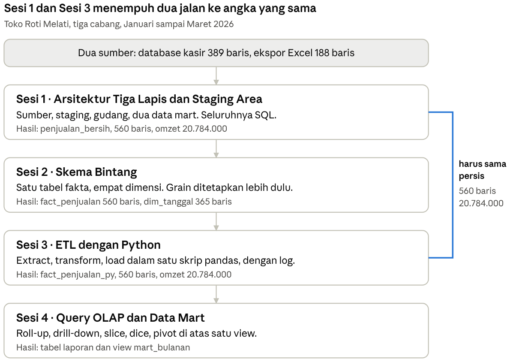

# Praktikum Data Warehouse — Paket Inti

Modul praktikum Mata Kuliah Data Warehouse, Program Studi Sistem Informasi.
Empat sesi berurutan, satu studi kasus, data ratusan baris — dirancang supaya
berjalan lancar di laptop berspesifikasi minimal.

Seluruh kode di repo ini sudah diuji jalan dari nol sampai selesai.

| Sesi | Judul | Alat | Materi minggu |
| --- | --- | --- | --- |
| 1 | Arsitektur Tiga Lapis | SQL | 3 |
| 2 | Skema Bintang | SQL | 4, 5, 6 |
| 3 | ETL dengan Python | Python | 8, 9 |
| 4 | Query OLAP dan Data Mart | SQL | 7, 13 |

**Jadwal belajar mandiri 8 minggu ada di [JADWAL_BELAJAR.md](JADWAL_BELAJAR.md).**

**Modul lengkapnya ada di [MODUL.md](MODUL.md)** — penjelasan tiap sesi, kode
yang dibahas baris per baris, titik periksa, dan kaitannya ke skripsi. Versi
cetaknya ada di folder [`modul-pdf/`](modul-pdf) dalam delapan berkas A4.



Sesi 1 mengerjakan integrasi dengan SQL, Sesi 3 mengerjakan ulang pekerjaan
yang sama dengan Python, dan keduanya harus berhenti di **560 baris dengan
omzet 20.784.000**. Kesamaan itulah inti seluruh praktikum.

## Cara mengambil repo ini

Ada tiga jalan. Pilih yang paling sesuai dengan laptopmu.

### 1. Codespaces — tanpa memasang apa pun

Klik tombol hijau **Code** di atas, pilih tab **Codespaces**, lalu
**Create codespace on main**. MariaDB, Python, dan seluruh pustakanya
disiapkan otomatis, dan data sumbernya langsung dibuat. Laptopmu cukup
menjalankan browser.

Sesudah terbuka, periksa kesiapannya:

```bash
python cek_pemasangan.py
```

Di Codespaces, setiap perintah `mysql -u root -p` di modul cukup ditulis
`mariadb` saja — nama server dan sandinya sudah tersimpan.

### 2. Unduh ZIP — tanpa git

Klik **Code** lalu **Download ZIP**, dan ekstrak di komputermu. Tidak perlu
tahu git sama sekali. Ini jalan yang paling sederhana kalau kamu hanya ingin
mengerjakan praktikumnya.

### 3. Clone dengan git

```bash
git clone https://github.com/fafa1230/data-warehouse-prodi-si.git
cd data-warehouse-prodi-si
```

## Spesifikasi minimum laptop

| Komponen | Minimum | Nyaman |
| --- | --- | --- |
| RAM | 4 GB | 8 GB |
| Ruang disk kosong | 2 GB | 5 GB |
| Prosesor | dua inti | apa pun yang lebih baru |
| Sistem operasi | Windows 10, macOS 11, atau Linux — semuanya 64-bit | — |

Praktikumnya sendiri sangat ringan: tiap langkah SQL selesai di bawah 0,2
detik, skrip ETL Sesi 3 butuh 1–3 detik dengan memori puncak 98 MB, dan
ketiga database di disk cuma 2 MB.

**Kalau RAM laptopmu 4 GB**, jalankan semua berkas SQL lewat perintah `mysql`
dan bukan lewat MySQL Workbench atau DBeaver yang bisa menghabiskan 300–500 MB
memori sendirian; pasang MariaDB saja, bukan XAMPP; dan tutup aplikasi lain
selama praktikum berjalan. Kalau RAM-mu di bawah 4 GB, pakai Codespaces di
atas.

## Pemasangan di komputer sendiri

| Perangkat | Keterangan |
| --- | --- |
| MySQL 8 atau MariaDB 10.4+ | tempat gudang data berdiri |
| Klien SQL | perintah `mysql`/`mariadb`; Workbench atau DBeaver kalau RAM lega |
| Python 3.9+ | hanya untuk Sesi 3 |

```bash
pip install -r requirements.txt
```

Isinya pendek: `pandas`, `SQLAlchemy`, `PyMySQL`.

Lalu beri tahu skrip Python cara masuk ke MySQL-mu. Cara paling aman lewat
variabel lingkungan, supaya sandimu tidak pernah ikut tersimpan di berkas:

```bash
export DW_USER=root
export DW_PASS=sandimu
```

Kalau lebih suka, `DB_USER` dan `DB_PASS` di `konfigurasi.py` juga bisa diubah
langsung — hanya berkas itu yang perlu disentuh. **Jangan commit sandi aslimu
kalau kamu mem-fork repo ini.**

Periksa kesiapan laptopmu sebelum mulai:

```bash
python cek_pemasangan.py
```

Skrip itu memeriksa RAM dan sisa disk, versi Python, ketiga pustaka, kedua
berkas data, dan koneksi MySQL, lalu menyebutkan persis apa yang kurang
beserta cara memperbaikinya.

## Urutan menjalankan

Semua perintah dijalankan **dari folder utama repo ini**, bukan dari dalam
folder sesi. Beberapa berkas menunjuk ke `data/...` dengan jalur relatif.

```bash
# Persiapan sekali saja — membuat data sumber
python data/generate_data.py

# --- Sesi 1: arsitektur tiga lapis ---------------------------------
mysql -u root -p                  < sesi1_arsitektur_tiga_lapis/01_buat_lapisan.sql
mysql -u root -p sumber_kasir     < data/seed_sumber.sql
mysql -u root -p --local-infile=1 < sesi1_arsitektur_tiga_lapis/03_staging.sql
mysql -u root -p                  < sesi1_arsitektur_tiga_lapis/04_gudang_dan_mart.sql
mysql -u root -p -t               < sesi1_arsitektur_tiga_lapis/05_verifikasi.sql

# --- Sesi 2: skema bintang -----------------------------------------
mysql -u root -p -t < sesi2_skema_bintang/01_dimensi.sql
mysql -u root -p -t < sesi2_skema_bintang/02_fakta.sql
mysql -u root -p -t < sesi2_skema_bintang/03_verifikasi.sql

# --- Sesi 3: ETL dengan Python -------------------------------------
python sesi3_etl_python/etl.py

# --- Sesi 4: query OLAP dan data mart ------------------------------
mysql -u root -p -t < sesi4_query_olap/olap.sql
```

Untuk mengulang seluruh rangkaian dari nol dalam satu perintah:

```bash
chmod +x jalankan_semua.sh
DW_USER=root DW_PASS=sandimu ./jalankan_semua.sh
```

## Angka kunci untuk memeriksa pekerjaanmu

Data dibuat dengan bilangan acak berseed tetap, jadi **angkamu harus persis
sama**. Berbeda satu saja berarti ada langkah yang terlewat.

| Titik periksa | Nilai benar |
| --- | --- |
| `stg_penjualan_kasir` | 389 |
| `stg_penjualan_barat` | 188 |
| `penjualan_bersih` (Sesi 1) | 560 |
| dari kasir / dari Excel | 389 / 171 |
| Jumlah nota | 310 |
| Produk berbeda | 8 |
| Omzet satu kuartal | 20.784.000 |
| `dim_tanggal` (Sesi 2) | 365 |
| `fact_penjualan` (Sesi 2) | 560 |
| Hari tanpa penjualan | 275 |
| `fact_penjualan_py` (Sesi 3) | 560 |
| Omzet versi Python | 20.784.000 |
| Omzet Jan / Feb / Mar (Sesi 4) | 7.581.000 / 6.094.000 / 7.109.000 |
| Total `WITH ROLLUP` | 20.784.000 |

## Kalau tersendat

| Gejala | Sebabnya | Perbaikannya |
| --- | --- | --- |
| `LOAD DATA LOCAL INFILE` ditolak | klien tidak mengizinkan | jalankan dengan `--local-infile=1`, atau `SET GLOBAL local_infile=1;` |
| `File 'data/penjualan_barat.csv' not found` | folder kerja salah | kembali ke folder utama repo |
| `Access denied for user` | sandi kosong atau autentikasi soket | isi `DW_PASS`, atau buat pengguna khusus `CREATE USER 'dw'@'%' IDENTIFIED BY 'dw';` |
| Query Sesi 4 lambat sekali | indeks belum terbentuk | jalankan ulang `python sesi3_etl_python/etl.py` |
| Angka tidak cocok tabel di atas | ada langkah terlewat | `DROP DATABASE` ketiganya, mulai dari awal |

Mengulang dari nol hanya butuh dua menit di paket sekecil ini.

## Isi folder

```
data-warehouse-si/
├── README.md                     panduan ini
├── MODUL.md                      modul lengkap empat sesi
├── modul-pdf/                    modul versi cetak, 8 berkas A4
├── konfigurasi.py                satu-satunya berkas yang perlu kamu ubah
├── cek_pemasangan.py             pemeriksa kesiapan laptop
├── requirements.txt              tiga pustaka Python
├── jalankan_semua.sh             menjalankan 4 sesi sekaligus dari nol
├── .devcontainer/                penyiapan otomatis untuk Codespaces
├── data/
│   ├── generate_data.py          pembuat data sumber (dijalankan sekali)
│   ├── seed_sumber.sql           transaksi Cabang Pusat & Timur
│   └── penjualan_barat.csv       ekspor Excel Cabang Barat (sengaja berantakan)
├── sesi1_arsitektur_tiga_lapis/  SQL — sumber, staging, gudang, data mart
├── sesi2_skema_bintang/          SQL — fakta, dimensi, grain, surrogate key
├── sesi3_etl_python/             Python — extract, transform, load
├── sesi4_query_olap/             SQL — roll-up, drill-down, slice, dice, pivot
└── keluaran/                     hasil CSV (dibuat otomatis)
```

## Lisensi

Kode dalam repo ini memakai [lisensi MIT](LICENSE). Teks modul, termasuk
`MODUL.md` dan berkas di `modul-pdf/`, memakai
[CC BY 4.0](LICENSE-MODUL) — bebas dipakai dan diubah asal sumbernya
dicantumkan.
